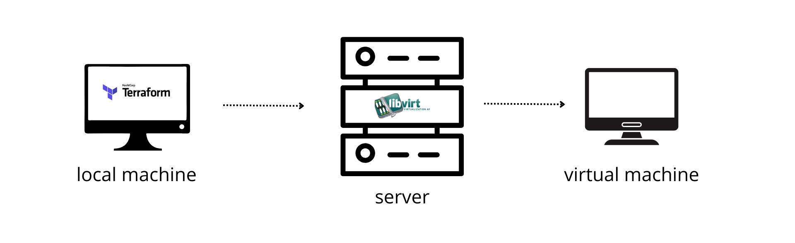

# libvirt-vm-creator-terraform
Terraform code that helps you create vms in simple and straight forward way using the libvirt provider

## Prereqs:
* I am running on a Supermicro X9DRW server
* Host OS: 20.04.4 LTS (Focal Fossa)
* I have two bridges one with a DNS to get a private ip and one for public ips (statically defined)
* Before we begin, In my case cloud and iso images are stored under /var/lib/libvirt/images and it is part of lvroot (if you don't have enough storage the vms will have problems booting and running), So before we continue(I will assume you have the same setup), Let's first create another lvm to store our vm disks
```
sudo lvcreate -L 500G vgroot --name libvirtlv
sudo mkfs.ext4 /dev/vgroot/libvirtlv
sudo mkdir -p /var/lib/libvirt/images_new
sudo mount /dev/vgroot/libvirtlv /var/lib/libvirt/images_new/
echo '/dev/vgroot/libvirtlv /var/lib/libvirt/images_new ext4 defaults 0 2' | sudo tee -a /etc/fstab
sudo virsh list --all | grep running | awk '{print $2}' | xargs -I{} virsh shutdown {} #Stop All running VMS
sudo cp -av /var/lib/libvirt/images/* /var/lib/libvirt/images_new/
sudo diff -r /var/lib/libvirt/images /var/lib/libvirt/images_new/ # Make sure everything was done correctly
sudo systemctl stop libvirtd
sudo virsh pool-dumpxml default > pool.xml # Change to your current pool ()
sed -i 's#<path>/var/lib/libvirt/images</path>#<path>/var/lib/libvirt/images_new</path>#' default-pool.xml
sudo virsh pool-define --file default-pool.xml
sudo mv /var/lib/libvirt/images /var/lib/libvirt/images_old
sudo ln -s /var/lib/libvirt/images_new/var/lib/libvirt/images
sudo systemctl start libvirtd
virsh pool-list # Check if all is in place
```
Now we have a storage where to store all our qcow2 and cloud init files 
Also to simplify the work you can add your users to suders (without password):
```
sudo visudo
terraform_user    ALL=(ALL) NOPASSWD: ALL
```
Also to avoid any errors with libvirt add this line to /etc/libvirt/qemu.conf 
```
sudo nano /etc/libvirt/qemu.conf
security_driver = "none"
sudo systemctl restart libvirtd
```
Now we should be good.

Note that in terraform.tfvars we specify some variables that you have to fill (vm name, wether to use a local cloud image ..)
Fetching cloud images over terraform could take some time use wget with the image you like from 
[Releases Link](https://cloud-images.ubuntu.com/releases/) under /var/lib/libvirt/images_new/
```
cd /var/lib/libvirt/images_new/
sudo wget https://cloud-images.ubuntu.com/releases/focal/release/ubuntu-20.04-server-cloudimg-amd64.img
```

after that you open a terminal and clone this repo and change the values in terraform.tfvars to match your environment

```
git clone https://github.com/TahaMohsenZeidy/libvirt-vm-creator-terraform.git
cd libvirt-vm-creator-terraform
nano terraform.tfvars
```

run terraform init and terraform apply; after that you can ssh into the vm with the command you got from the output and do what you want :)

We will use this code as a base to build a HA k8s cluster: check out the repo [here](https://github.com/TahaMohsenZeidy/k8s-ha-cluster-terraform).


